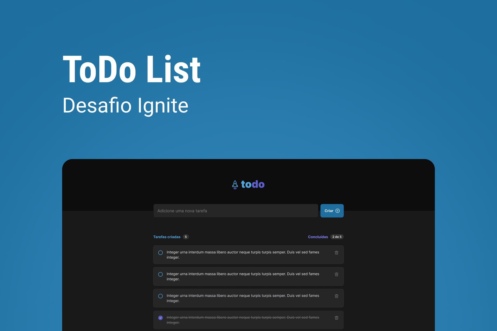

<!-- Logotipo -->
<div align="center">
  
</div>

<!-- Title -->
<h1 align="center"> TODO List Remastered </h1>

<!-- Sobre o Projeto -->

## 🧐 Sobre o Projeto

Aplicação para criação de uma lista tarefas com possibilidade de conclusão.

## 🚀 Tecnologias e Bibliotecas

- [React](https://reactjs.org)
- [TypeScript](https://www.typescriptlang.org/)

## 💻 Rodando o Projeto

```
# Abra um terminal e copie este repositório com o comando
$ git clone https://github.com/lucasbarque/TodoListRemastered.git

# Acesse a pasta da aplicação
$ cd TodoListRemastered

# Instale as dependências
$ yarn

# Inicie a aplicação
$ yarn dev

```
